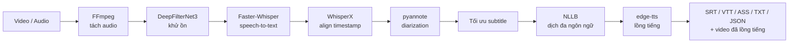

# 🎬 AI Subtitle Studio

<p align="center"><em>Tool cá nhân tự động tạo phụ đề &amp; lồng tiếng đa ngôn ngữ cho video,<br/>chạy 100% bằng pipeline AI mã nguồn mở trên máy có GPU.</em></p>

<p align="center">
  
  
  
  
  
</p>

---

## ✨ Tính năng

- 🗣️ **Phụ đề tự động** — tách audio (FFmpeg), khử ồn (DeepFilterNet3), speech-to-text (Faster-Whisper), align timestamp (WhisperX), phân biệt người nói (pyannote diarization).
- 🌐 **Dịch đa ngôn ngữ** — NLLB-200, kèm bảng thuật ngữ riêng để giữ đúng từ chuyên ngành khi dịch.
- 🎙️ **Lồng tiếng (dubbing)** — edge-tts (giọng Neural TTS miễn phí của Microsoft), tự gán giọng khác nhau cho từng người nói, có bảng phát âm riêng cho từ viết tắt (vd. "SQL" → "ét quy eo").
- 🎨 **Tùy biến phụ đề** — chọn font/màu chữ/màu nền, kéo-thả vị trí, hardsub (ghi cứng phụ đề vào video).
- 🔊 **Xử lý âm thanh** — giữ/giảm âm lượng tiếng gốc, ducking tự động khi giọng lồng tiếng đang nói.
- 📥 **Tải video từ YouTube** — kèm cơ chế tự làm mới cookie bằng Playwright để tránh bị chặn "Sign in to confirm you're not a bot".
- 🧙 **Wizard 6 bước** — Nguồn → Giọng đọc → Dịch → Phụ đề → Âm thanh & Xuất → Xem lại, khóa tuần tự từng bước.
- 🤖 **Bot Telegram** — gửi link video qua chat, bot tự xử lý và trả kết quả qua Telegram hoặc email.
- 👤 **Web app đầy đủ** — đăng ký/đăng nhập, trang quản trị (admin), theo dõi tiến độ job theo thời gian thực, gửi email khi job hoàn thành.

## 🧠 Kiến trúc pipeline



VRAM giới hạn (dev trên GPU 6GB) nên pipeline load model **tuần tự** — dùng xong bước nào giải phóng VRAM bước đó, không giữ nhiều model cùng lúc trên GPU.

## 🛠️ Công nghệ sử dụng

| Layer | Công nghệ |
|---|---|
| AI pipeline | FFmpeg · DeepFilterNet3 · Faster-Whisper · WhisperX · pyannote.audio · NLLB-200 · edge-tts |
| Backend | FastAPI · Celery · SQLAlchemy · PostgreSQL · Redis |
| Frontend | React 18 · TypeScript · Vite · Tailwind CSS · TanStack Query |
| Hạ tầng dev | Docker Compose · GitHub Actions CI (Ruff + pytest + frontend build) |

## 💻 Yêu cầu máy chạy

Dự án là **tool cá nhân**, thiết kế chạy trên máy có GPU NVIDIA (đã xác nhận chạy được trên RTX 4050 Laptop 6GB VRAM). Cần Python 3.12, FFmpeg, Docker Desktop, torch bản CUDA. Xem checklist cài đặt đầy đủ tại mục **"0. Setup nhanh trên máy dev thật"** trong [HANDOFF.md](HANDOFF.md).

## 🚀 Chạy dev

Cách nhanh nhất — 1 lệnh khởi động toàn bộ (Docker Compose + Celery + FastAPI + Vite):

```powershell
powershell -ExecutionPolicy Bypass -File .\start_project.ps1
```

Sau khi chạy xong, mở **http://localhost:5173**.

Dừng lại:

```powershell
powershell -ExecutionPolicy Bypass -File .\stop_project.ps1
```

<details>
<summary><b>Chạy thủ công từng tiến trình</b></summary>

```powershell
docker compose up -d
python -m celery -A app.jobs.celery_app worker --loglevel=info --pool=solo
python -m uvicorn backend.main:app --host localhost --port 8000 --reload
cd frontend; npm run dev -- --host localhost --port 5173
```

</details>

## 📚 Tài liệu

| File | Nội dung |
|---|---|
| [HANDOFF.md](HANDOFF.md) | **Đọc trước tiên** — trạng thái/tiến độ/quyết định kiến trúc mới nhất, dùng chung giữa Claude Code và Codex |
| [docs/CODE_STYLE.md](docs/CODE_STYLE.md) | Chuẩn code Python (Ruff format/lint, type hint, quy ước đặt tên) |
| [docs/memory/](docs/memory/README.md) | Bối cảnh/lý do đằng sau các quyết định kiến trúc (máy dev, quy ước HANDOFF...) |

---

<p align="center"><sub>Dự án cá nhân, phi thương mại — không giới hạn usage/gói cước.</sub></p>
